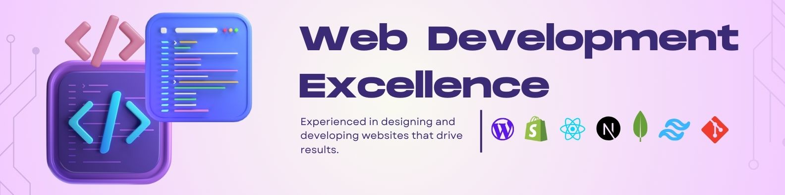

### Hi there 👋,  
### My name is MD.AL-AMIN

I'm a front-end developer with an emphasis on clean responsive design. I have over 2 years of extensive experience in front-end for individuals and businesses.
I'm ready for productive work :)

## Languages and Tools:

 

```
🌱 I’m currently learning MERN Stack and WordPress 
```
## Connect with me:

[](https://www.facebook.com/webmdalamin)
[](https://www.linkedin.com/in/mdalamin75/)  [](https://twitter.com/md_alamin75)
[](https://www.instagram.com/md_alamin75/)[](https://mdalamin.netlify.app/)

<br/>

[](https://github.com/anuraghazra/github-readme-stats)

  

  

  

